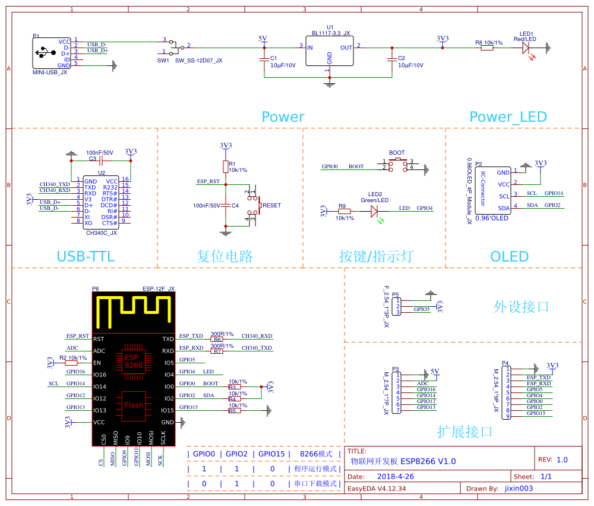

# MQTT Dashboard Demo

物联网体验项目，包括一个由Arduino编写的设备端、Vue编写的管理员端和Spring Boot编写的后端组成。

## Arduino 设备




## Arduino 依赖库

- [ArduinoJson](https://github.com/bblanchon/ArduinoJson)
- [DHTesp](https://github.com/beegee-tokyo/DHTesp)
- [PubSubClient](https://github.com/knolleary/pubsubclient/)
- [SSD1306Wire](https://github.com/ThingPulse/esp8266-oled-ssd1306)
- [U8g2lib](https://github.com/olikraus/u8g2)

## 运行 Vue

```
npm run serve
```
